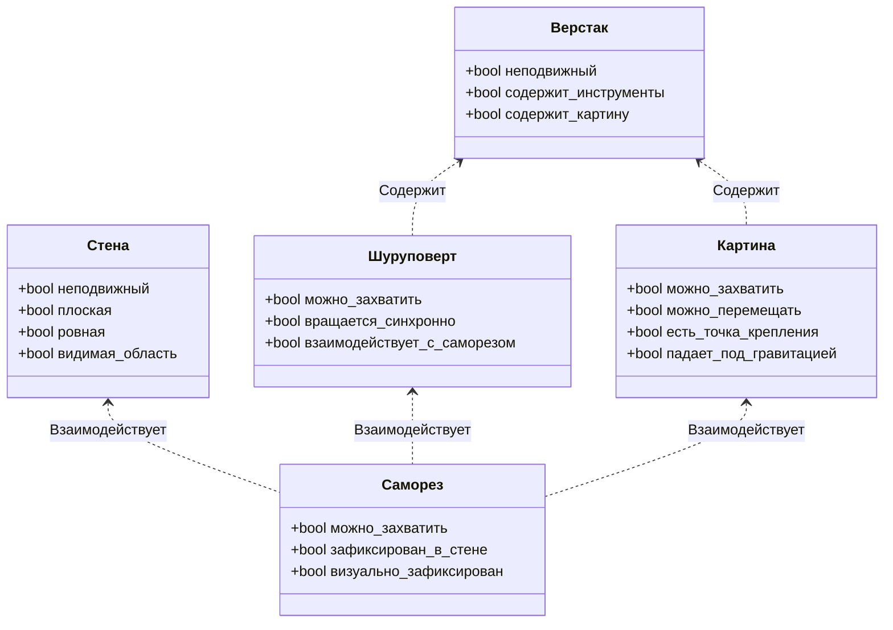

```mermaid
classDiagram
    class Стена {
        +bool неподвижный
        +bool плоская
        +bool ровная
        +bool видимая_область
    }

    class Саморез {
        +bool можно_захватить
        +bool зафиксирован_в_стене
        +bool визуально_зафиксирован
    }

    class Шуруповерт {
        +bool можно_захватить
        +bool вращается_синхронно
        +bool взаимодействует_с_саморезом
    }

    class Картина {
        +bool можно_захватить
        +bool можно_перемещать
        +bool есть_точка_крепления
        +bool падает_под_гравитацией
    }

    class Верстак {
        +bool неподвижный
        +bool содержит_инструменты
        +bool содержит_картину
    }

    Стена <.. Саморез : Взаимодействует
    Шуруповерт <.. Саморез : Взаимодействует
    Картина <.. Саморез : Взаимодействует
    Верстак <.. Шуруповерт : Содержит
    Верстак <.. Картина : Содержит
```