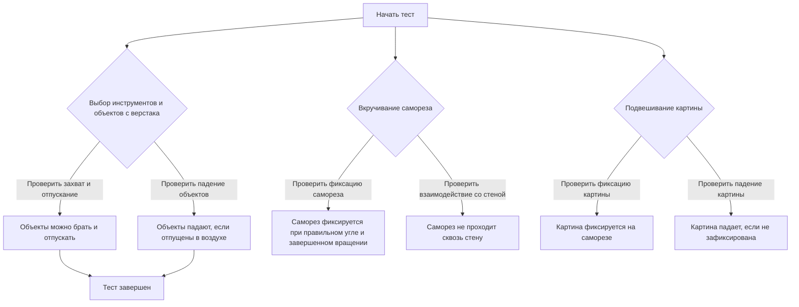

```mermaid
graph TD
    A[Начать тест] --> B{Выбор инструментов и объектов с верстака}
    B -->|Проверить захват и отпускание| C[Объекты можно брать и отпускать]
    B -->|Проверить падение объектов| D[Объекты падают, если отпущены в воздухе]

    A --> E{Вкручивание самореза}
    E -->|Проверить фиксацию самореза| F[Саморез фиксируется при правильном угле и завершенном вращении]
    E -->|Проверить взаимодействие со стеной| G[Саморез не проходит сквозь стену]

    A --> H{Подвешивание картины}
    H -->|Проверить фиксацию картины| I[Картина фиксируется на саморезе]
    H -->|Проверить падение картины| J[Картина падает, если не зафиксирована]

    C --> K[Тест завершен]
    D --> K
   
```