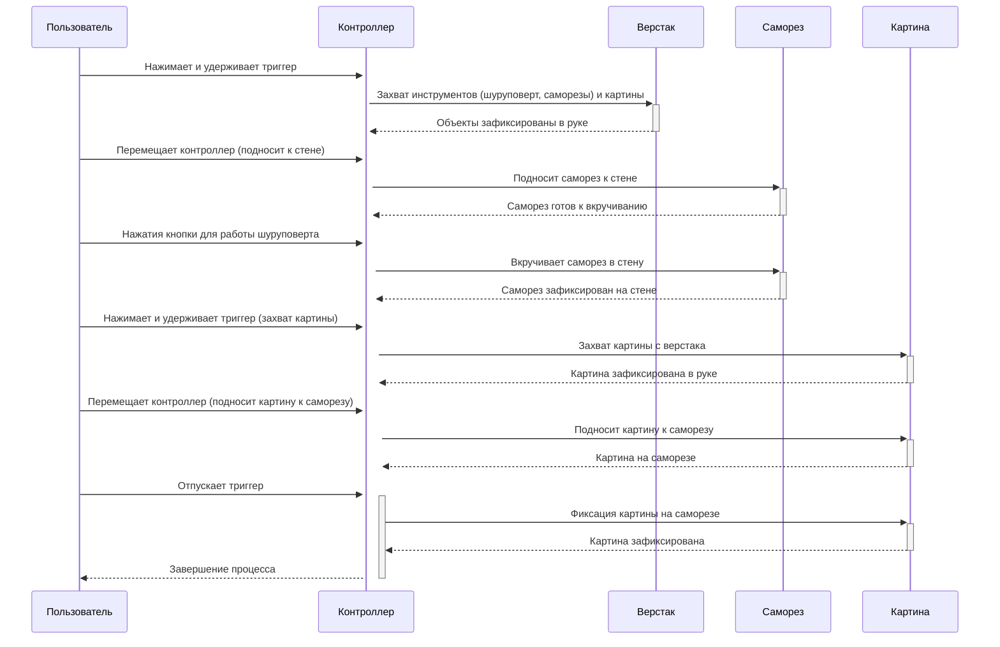

```mermaid
sequenceDiagram
    participant Пользователь
    participant Контроллер
    participant Верстак
    participant Саморез
    participant Картина
    

    Пользователь->>+Контроллер: Нажимает и удерживает триггер
    Контроллер->>+Верстак: Захват инструментов (шуруповерт, саморезы) и картины
    Верстак-->>-Контроллер: Объекты зафиксированы в руке
    Пользователь->>+Контроллер: Перемещает контроллер (подносит к стене)
    Контроллер->>+Саморез: Подносит саморез к стене
    Саморез-->>-Контроллер: Саморез готов к вкручиванию
    Пользователь->>+Контроллер: Нажатия кнопки для работы шуруповерта
    Контроллер->>+Саморез: Вкручивает саморез в стену
    Саморез-->>-Контроллер: Саморез зафиксирован на стене
    Пользователь->>+Контроллер: Нажимает и удерживает триггер (захват картины)
    Контроллер->>+Картина: Захват картины с верстака
    Картина-->>-Контроллер: Картина зафиксирована в руке
    Пользователь->>+Контроллер: Перемещает контроллер (подносит картину к саморезу)
    Контроллер->>+Картина: Подносит картину к саморезу
    Картина-->>-Контроллер: Картина на саморезе
    Пользователь->>+Контроллер: Отпускает триггер
    Контроллер->>+Картина: Фиксация картины на саморезе
    Картина-->>-Контроллер: Картина зафиксирована
    Контроллер-->>-Пользователь: Завершение процесса
```