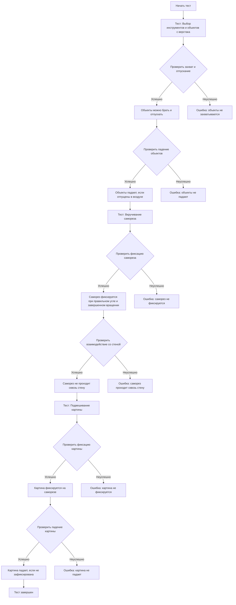

```mermaid
graph TD
    A[Начать тест] --> B[Тест: Выбор инструментов и объектов с верстака]
    B --> C{Проверить захват и отпускание}
    C -->|Успешно| D[Объекты можно брать и отпускать]
    C -->|Неуспешно| E[Ошибка: объекты не захватываются]
    D --> F{Проверить падение объектов}
    F -->|Успешно| G[Объекты падают, если отпущены в воздухе]
    F -->|Неуспешно| H[Ошибка: объекты не падают]

    G --> I[Тест: Вкручивание самореза]
    I --> J{Проверить фиксацию самореза}
    J -->|Успешно| K[Саморез фиксируется при правильном угле и завершенном вращении]
    J -->|Неуспешно| L[Ошибка: саморез не фиксируется]
    K --> M{Проверить взаимодействие со стеной}
    M -->|Успешно| N[Саморез не проходит сквозь стену]
    M -->|Неуспешно| O[Ошибка: саморез проходит сквозь стену]

    N --> P[Тест: Подвешивание картины]
    P --> Q{Проверить фиксацию картины}
    Q -->|Успешно| R[Картина фиксируется на саморезе]
    Q -->|Неуспешно| S[Ошибка: картина не фиксируется]
    R --> T{Проверить падение картины}
    T -->|Успешно| U[Картина падает, если не зафиксирована]
    T -->|Неуспешно| V[Ошибка: картина не падает]

    U --> W[Тест завершен]
```